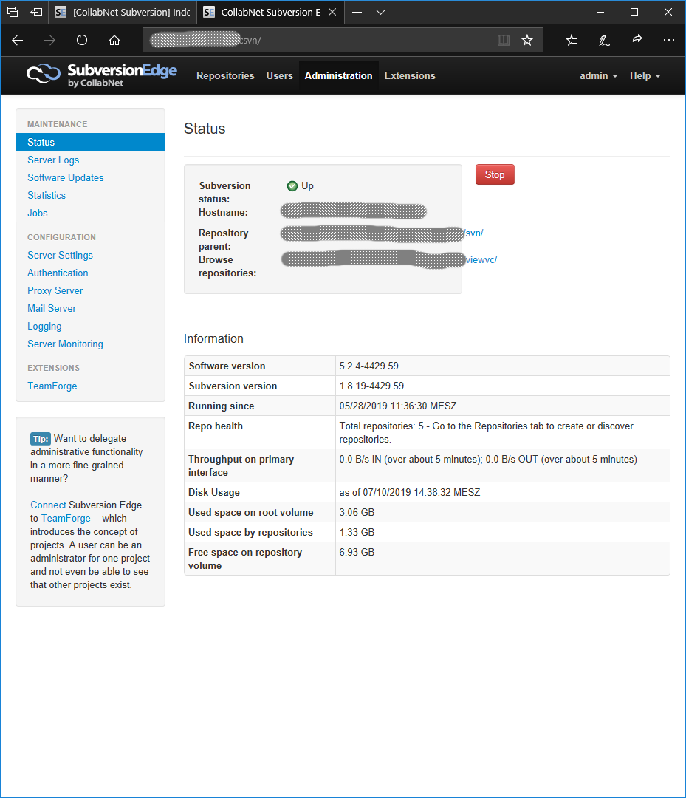
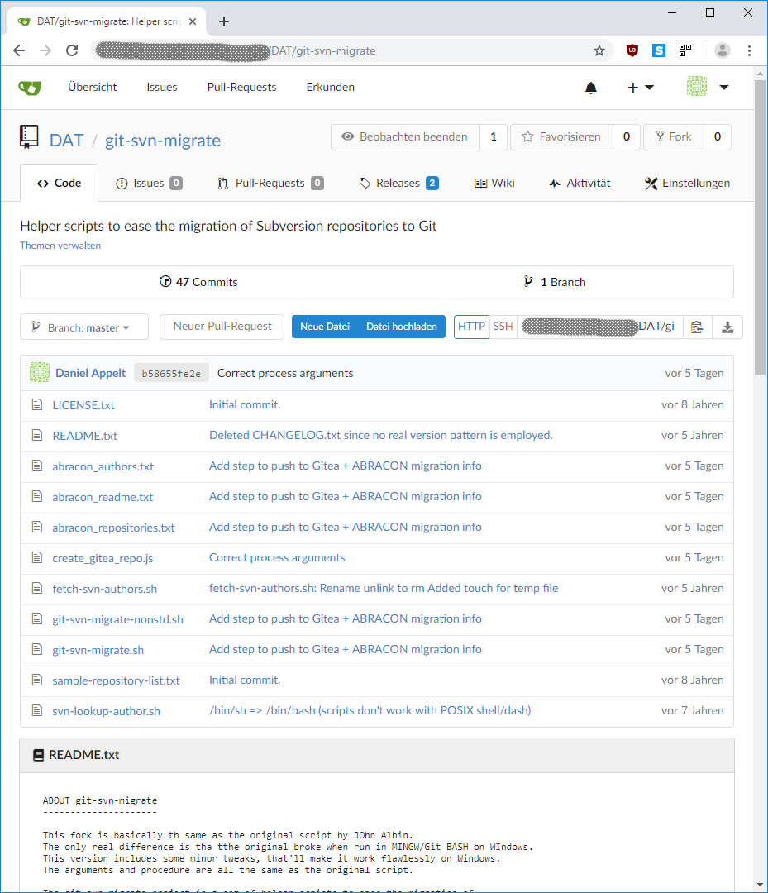

= Gitea
:customcss: presentation.css
:linkattrs:

link:https://www.webmontag-bonn.de/[Webmontag Bonn]

link:https://github.com/danielappelt[Daniel Appelt, window="_blank"] / 2019-07-15

== Hintergrund

[%step]
* link:http://abracon.de/[ABRACON GmbH] | Bonn | ca. 20 Mitarbeiter
* SAP-Umfeld | Business Intelligence

== Wo kamen wir her?

[%step]
* link:https://www.collab.net/products/subversion[Subversion Edge]
* "Multiple Projects Layout"
* ca. 200 Projekte aus 15 Jahren

[%notitle]
=== Screenshot Subversion Edge 1

== Was war unsere Vision?

[%step]
* Dezentrale Versionsverwaltung
* Github-Features: Issues, Wiki, ...
* On Premise
* LDAP-User-Accounts
* Windows-Service

== link:https://gitea.io/[Gitea]

[%step]
* quelloffene Code-Hosting-Plattform
* leichtgewichtig
* läuft "überall"

[.notes]
--
* Installation auf Raspberry Pi wird beworben
* Verfügbar als Docker-Images, Zip, ..
* Unterstützung vieler Datenbank-Systeme
* wird aktiv weiter entwickelt
--

== Installation

[%step]
* Chocolatey link:https://chocolatey.org/packages/gitea[Paket]
* eine link:https://github.com/go-gitea/gitea/blob/master/custom/conf/app.ini.sample[Konfigurationsdatei]
* Windows-Service ist link:https://docs.gitea.io/en-us/windows-service/[Einzeiler]

[.notes]
--
* sqlite und SSH-Server eingebaut
--

== User-Accounts

[%step]
* LDAP-Authentifizierung
* Konfiguration über Web-Interface
* Beispiel-Ausdrücke für Microsoft AD link:https://docs.gitea.io/en-us/authentication/[dokumentiert]

== Migration von Subversion

[%step]
* Migration mit link:https://github.com/BlueWombat/git-svn-migrate[Github-Projekt] nach Git "einfach"
* ...........................

[.notes]
--
* Man erhält "bare" Repositorys, die man in den passenden Gitea-Ordner legen kann
* Inhalte tauchen in Gitea jedoch nicht auf..
--

=== Probleme

[%step]
* Jedes Projekt muß in Gitea angelegt werden
* Gitea muß jeden Commit "sehen"
* Repository-Zuordnung zu User / Projekt

=== Lösung

[%step]
* link:https://try.gitea.io/api/swagger[Gitea (REST) API]
* link:https://gist.github.com/danielappelt/5c1d5bf2058a7b36b5f150fe93522962[Node Skript] erzeugt Repository
* remote add und push befüllt es aus migriertem "bare" Repository
* Zuordnung zu User / Projekt manuell

[%notitle]
=== Screenshot Gitea 1

== Fazit

[%step]
* Gitea ist leicht zu installieren
* Bessere Unterstützung für Massen-Import wünschenswert

[.notes]
--
* Import einzelner Repositorys von Github geht über die Weboberfläche
* im Discourse Forum gibt es unbeantwortete Fragen bzgl. Massenimport
--
